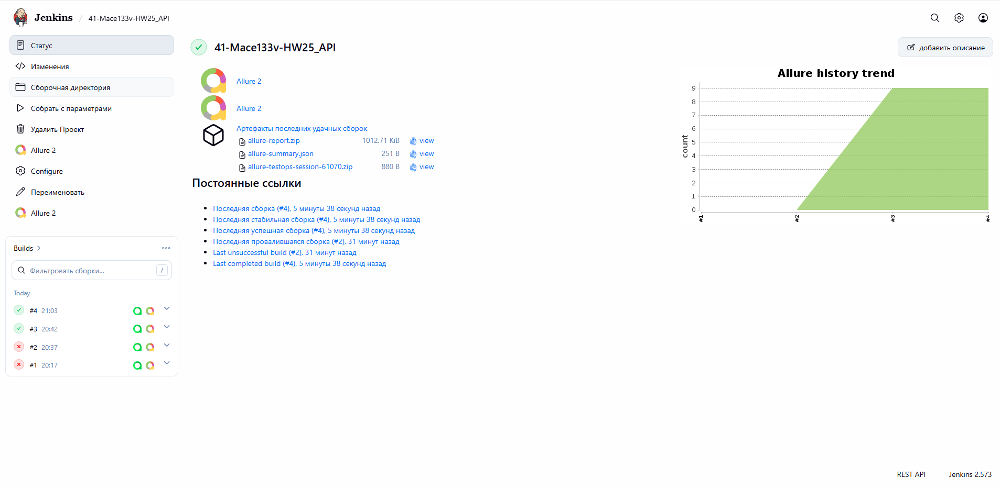
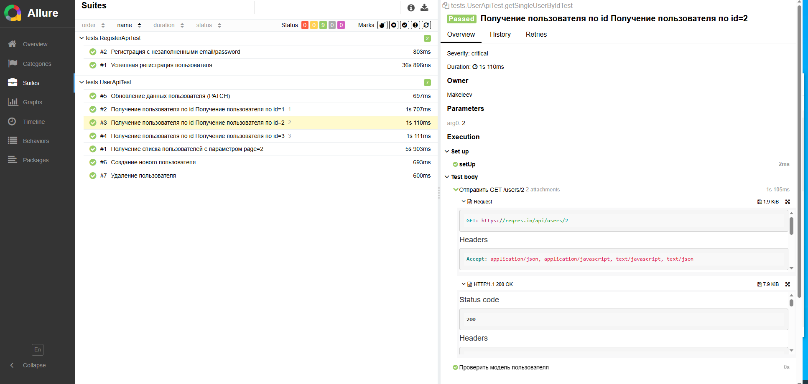
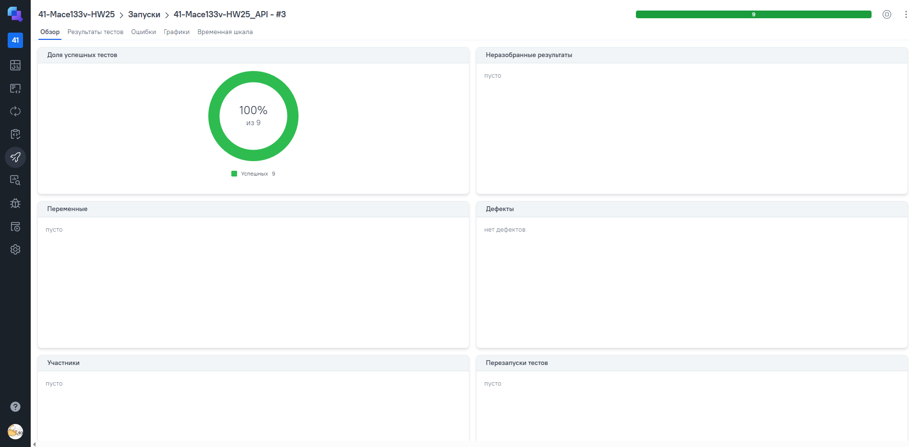
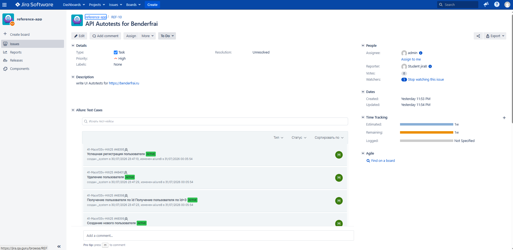
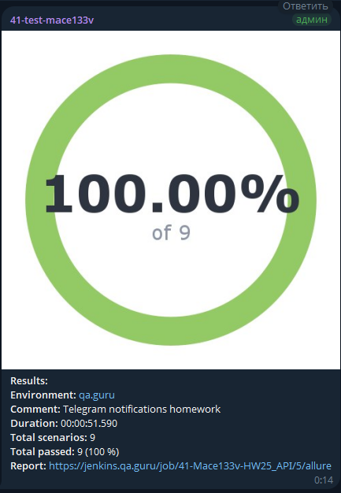

# Проект по автоматизации тестирования API [reqres.in](https://reqres.in/)

<p align="center">

</p>

> Test your front-end against a real API

## Содержание

* <a href="#tools">Используемый стек</a>
* <a href="#cases">Примеры автоматизированных тест-кейсов</a>
* <a href="#console">Запуск из терминала</a>
* <a href="#jenkins">Сборка в Jenkins</a>
* <a href="#allure">Allure отчёт</a>
* <a href="#allure-testops">Интеграция с Allure TestOps</a>
* <a href="#jira">Интеграция с Jira</a>
* <a href="#telegram">Уведомление в Telegram</a>

____
<a id="tools"></a>

## <a name="Используемый стек">**Используемый стек**</a>

<p align="center">
<a href="https://www.java.com/"></a>
<a href="https://rest-assured.io/"></a>
<a href="https://github.com/allure-framework/allure2"></a>
<a href="https://qameta.io/"></a>
<a href="https://gradle.org/"></a>
<a href="https://junit.org/junit5/"></a>
<a href="https://github.com/"></a>
<a href="https://www.jenkins.io/"></a>
<a href="https://web.telegram.org/a/"></a>
<a href="https://www.atlassian.com/ru/software/jira/"></a>
<a href="https://www.jetbrains.com/ru-ru/idea/"></a>
</p>

____
<a id="cases"></a>

## <a name="Примеры автоматизированных тест-кейсов">**Примеры автоматизированных тест-кейсов**</a>

____
- :white_check_mark: Тестирование запроса PATCH с обновлением данных Users по полю job/name
- :white_check_mark: Тестирование запроса POST регистрация пользователя с незаполненными email/password
- :white_check_mark: Тестирование запроса POST регистрация пользователя
- :white_check_mark: Тестирование запроса POST создание пользователя с проверкой ответа
- :white_check_mark: Тестирование запроса GET получить пользователя по его id
- :white_check_mark: Тестирование запроса DELETE удаление пользователя
- :white_check_mark: Тестирование запроса GET List Users ?page=2

____
<a id="console"></a>

## Запуск автотестов

***Команда запуска тестов из терминала:***

```
gradle clean test
```

***Запуск с параметрами (как в Jenkins):***

```
gradle clean test -DbaseUri=https://reqres.in -DbasePath=/api -DAPI_KEY=your_key
```

____
<a id="jenkins"></a>

##  <a name="Сборка">Сборка в [Jenkins](https://jenkins.qa.guru/job/41-Mace133v-HW25_API/)</a>

<p align="center">
<a href="https://jenkins.qa.guru/job/41-Mace133v-HW25_API/"></a>
</p>

***Параметры сборки:***
- `API_KEY` — ключ API с [app.reqres.in](https://app.reqres.in/api-keys)
- `BASE_URI` — `https://reqres.in`
- `BASE_PATH` — `/api`

***Команда в Jenkins:***

```
clean test
-DbaseUri=$BASE_URI
-DbasePath=$BASE_PATH
-DAPI_KEY=$API_KEY
-DEMAIL=eve.holt@reqres.in
-DPASSWORD=pistol
```

____
<a id="allure"></a>

##  Allure <a target="_blank" href="https://jenkins.qa.guru/job/41-Mace133v-HW25_API/5/allure-report/">отчёт</a>

### *Пример отчёта о прохождении тестов*

<p align="center">
<a href="https://jenkins.qa.guru/job/41-Mace133v-HW25_API/5/allure-report/"></a>
</p>

____
<a id="allure-testops"></a>

##  Интеграция с <a target="_blank" href="https://allure.qa.guru/project/5303/test-cases?treeId=0">Allure TestOps</a>

### *Allure TestOps Dashboard*

<p align="center">
<a href="https://allure.qa.guru/project/5303/test-cases?treeId=0"></a>
</p>

____
<a id="jira"></a>

##  Интеграция с <a target="_blank" href="https://jira.qa.guru/browse/REF-10">Jira</a>

<p align="center">
<a href="https://jira.qa.guru/browse/REF-10"></a>
</p>

____
<a id="telegram"></a>

##  Уведомление в Telegram

<p align="center">

</p>
