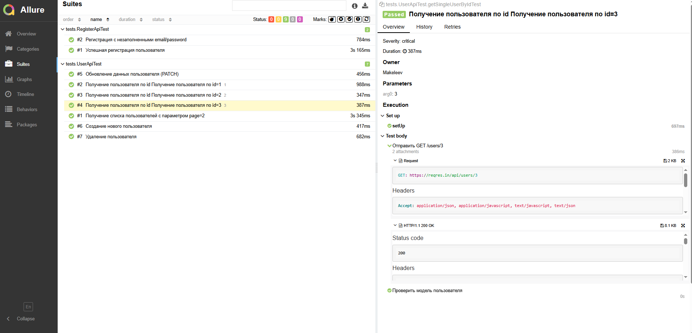

# Автоматизация API-тестирования [ReqRes](https://reqres.in/)

<p align="center">
  
</p>

Проект дипломной работы: автотесты REST API на Java + RestAssured + JUnit 5 + Allure.

## Содержание

* [Используемый стек](#computer-используемый-стек)
* [Покрытый функционал](#white_check_mark-покрытый-функционал)
* [Структура проекта](#структура-проекта)
* [Запуск тестов](#keyboard-запуск-автотестов)
* [Сборка в Jenkins](#сборка-в-jenkins)
* [Allure отчёт](#allure-отчёт)
* [Allure TestOps](#интеграция-с-allure-testops)
* [Jira](#интеграция-с-jira)
* [Telegram](#уведомление-в-telegram)

## :computer: Используемый стек

<p align="center">
<a href="https://www.java.com/"></a>
<a href="https://rest-assured.io/"></a>
<a href="https://github.com/allure-framework/allure2"></a>
<a href="https://qameta.io/"></a>
<a href="https://gradle.org/"></a>
<a href="https://junit.org/junit5/"></a>
<a href="https://github.com/"></a>
<a href="https://www.jenkins.io/"></a>
<a href="https://web.telegram.org/a/"></a>
<a href="https://www.atlassian.com/ru/software/jira/"></a>
<a href="https://www.jetbrains.com/ru-ru/idea/"></a>
</p>

- **Java**, **Gradle**, **JUnit 5**
- **RestAssured** — HTTP-запросы, specs, JSON Schema
- **Lombok** — модели request/response (`@Data`)
- **Owner** — конфиг из `auth.properties`
- **Allure** + `allure-rest-assured` с custom FreeMarker templates (`tpl/`)
- **AssertJ**, **Hamcrest**

## :white_check_mark: Покрытый функционал

### Автотесты
- GET список пользователей (`/users?page=2`) — статус, path, JSON Schema
- GET пользователь по id — параметризованный тест (`@ValueSource`: 1, 2, 3), десериализация в модель
- POST создание пользователя — DTO body + проверка модели ответа
- PATCH обновление пользователя
- DELETE удаление пользователя
- POST регистрация (успех / ошибка без email/password)

### Ручные тест-кейсы (`@Manual`, tag `manual`)
- Проверка документации reqres.in
- Поведение при невалидном `x-api-key`
- Проверка rate limit

## Структура проекта

```
src/test/java/
  config/       # ApiConfig (Owner)
  helpers/      # Specification, CustomApiListener, TestData
  model/        # DTO request/response (Lombok)
  tests/        # TestBase + автотесты + ручные кейсы
src/test/resources/
  auth.properties.example
  schemas/
  tpl/          # Allure request.ftl / response.ftl
```

Перед запуском скопируйте `auth.properties.example` → `auth.properties` и укажите свой `API_KEY` с [app.reqres.in](https://app.reqres.in/api-keys).

## :keyboard: Запуск автотестов

Локально:

```bash
gradlew clean test
gradlew allureServe
```

С параметрами (как в Jenkins):

```bash
gradlew clean test -DbaseUri=https://reqres.in -DbasePath=/api -DAPI_KEY=your_key
```

Ручные кейсы по умолчанию исключены (`excludeTags 'manual'`).

> **Selenoid** в API-проекте не используется: это Selenium Grid для UI (Selenide).  
> API-тесты ходят в REST напрямую через RestAssured. В Jenkins достаточно job с `gradlew clean test` и параметрами выше; Selenoid нужен только в UI-проекте (`remoteUrl`, browser, VNC/video).

## Сборка в Jenkins

### 1. Запушьте код в GitHub

Jenkins берёт код из репозитория. Локальные изменения должны быть в `origin`:

```bash
git add .
git commit -m "Prepare API project for Jenkins"
git push origin master
```

`auth.properties` в git не коммитьте (там ключ). В Jenkins передайте `API_KEY` параметром.

### 2. Создайте Freestyle job

1. Откройте [jenkins.autotests.cloud](https://jenkins.autotests.cloud/)
2. **New Item** → имя, например `41-Mace133v-API` → **Freestyle project**
3. **Source Code Management** → Git  
   - Repository URL: `https://github.com/MakeleevM/Makeleev_Diplom_Project_API.git`  
   - Branch: `*/master`
4. **This project is parameterized** → добавьте String Parameter:
   - `API_KEY` — ключ с [app.reqres.in](https://app.reqres.in/api-keys)
   - (опционально) `BASE_URI` = `https://reqres.in`
   - (опционально) `BASE_PATH` = `/api`
5. **Build** → **Invoke Gradle script** (или Execute shell):

```text
clean
test
-DbaseUri=${BASE_URI}
-DbasePath=${BASE_PATH}
-DAPI_KEY=${API_KEY}
-DEMAIL=eve.holt@reqres.in
-DPASSWORD=pistol
```

Если параметра `BASE_URI` нет, достаточно:

```text
clean
test
-DAPI_KEY=${API_KEY}
```

6. **Post-build Actions** → **Allure Report**:
   - Path: `build/allure-results`
7. **Save** → **Build with Parameters** → вставьте `API_KEY` → Build

> После создания job замените ссылку ниже на актуальную.

<a href="https://jenkins.autotests.cloud/view/java_students/job/41-Mace133v-API/">Jenkins Job</a>

<p align="center">
  <a href="https://jenkins.autotests.cloud/view/java_students/job/41-Mace133v-API/">
    
  </a>
</p>

## Allure отчёт

<a href="https://jenkins.autotests.cloud/view/java_students/job/41-Mace133v-API/allure/">Allure Report в Jenkins</a>

<p align="center">
  
</p>

## Интеграция с Allure TestOps

> Укажите ссылку на свой проект в Allure TestOps после настройки интеграции.

<p align="center">
  
</p>

## Интеграция с Jira

<p align="center">
  
</p>

## Уведомление в Telegram

<p align="center">
  
</p>
